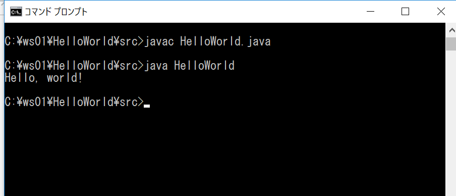
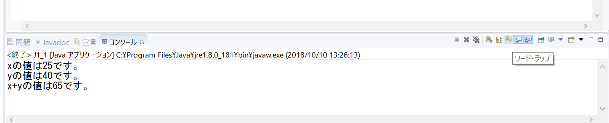
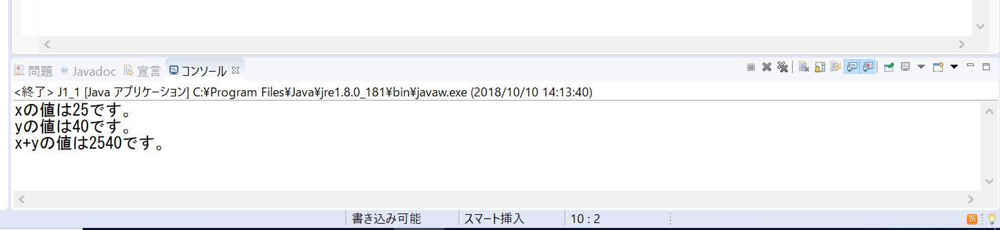
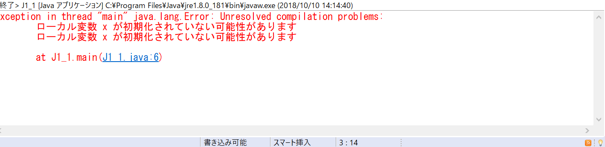

# プログラミング演習II 第１回
* 学籍番号：1764028
* 氏名：植田　岳洋
* 所属：情報工学EP

# 課題の説明

## 課題1:HelloWorld
  [ソースファイル](HelloWorld.java)
  printlnを用いて画面に"Hello, World!"と表示するプログラム
##  

## 考察
　c言語におけるprintfと異なり最後に\を入れずとも改行される。

## 課題2:J1_1
  [ソールファイル](J1_1.java)
  変数の表示、変数の足し算の結果の表示

## 実行結果　　
　

  

  

## 考察
  括弧を外すことにより足し算の和の働きをしていた'+'が文字列の連結をする働きをし、
2540という文字列としての結果が表示されている。また変数xを初期化しないとエラーとなる。　　

# 参考文献
演習用webサイト

# 謝辞

# 感想など
　Markdown記法が難しかったので解説をして欲しいです。
